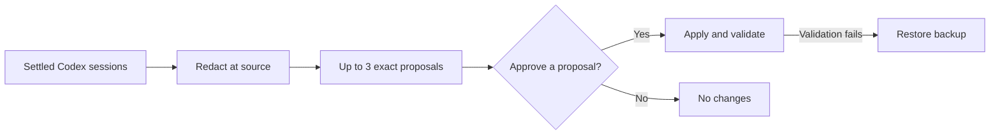

# Codex Session Improver

[](https://github.com/pfedotovsky/codex-session-improver/actions/workflows/ci.yml)
[](https://www.python.org/downloads/)
[](LICENSE)

> Experimental community project; not an official OpenAI product.

Turn evidence from past Codex sessions into safer, reviewable improvements to your instructions and documentation.

Codex Session Improver analyzes settled sessions locally and on auto-discovered SSH hosts, redacts findings at the source, and changes nothing until you approve an exact proposal. It can improve `AGENTS.md`, personal Agent Skills, and Markdown documentation without retaining raw transcript copies.

## How it works



The controller runs incrementally by default, so each settled session is normally assessed once. You can explicitly reprocess a recent time window after changing the analysis logic. Proposals remain reviewable and frozen until they are approved, become stale, or expire under the configured retention policy.

## Quick start

Add this repository as a Codex plugin marketplace and install the plugin:

```bash
codex plugin marketplace add pfedotovsky/codex-session-improver
codex plugin add codex-session-improver@codex-session-improver
```

Start a new Codex task and ask:

```text
Use $codex-improver to install the control project under ~/projects/codex-improver and create the recommended daily scheduled review.
```

The skill creates a private control project, installs stable deterministic scripts under `libexec/`, and creates the scheduled task through Codex's supported automation interface. It installs no hooks and requires no hook-trust setup.

To run the same workflow immediately without waiting for the schedule, ask from chat:

```text
Use $codex-improver to run the next session review now. Analyze only; do not apply proposals.
```

Both entry points call the same skill, so the safety and analysis workflow stays in one place. `scheduled-task.spec.toml` remains a portable, project-owned description rather than Codex's private automation format, and `automation-prompt.md` provides the generated one-line task prompt. The Codex app remains the runtime source of truth; only its supported automation interface edits private task state.

### Audit persistent global context

The installer also generates an optional companion task specification for a read-only audit of persistent global Codex context under the user's Codex and agents homes. It inventories global `AGENTS.md`, non-secret configuration structure, approval rules, personal skill metadata, configured plugins, app connectors, and effective MCP registrations. It never reads session transcripts or treats the complete config, plugin cache, or desktop state file as injected prompt text.

Ask Codex to create the separate daily audit:

```text
Use $codex-improver to create the daily persistent global-context audit from the generated companion task specification.
```

The default companion schedule is daily at 13:15 local time. Each run reports a measured summary and at most three reversible suggestions. It does not edit configuration, remove plugins or MCPs, create proposals, or apply changes. Run the same audit immediately with:

```bash
python3 ~/projects/codex-improver/libexec/global_context_audit.py
```

### Reanalyze recent sessions

To apply updated analysis logic to sessions that were already assessed, ask:

```text
Use $codex-improver to reanalyze settled sessions from the last day. Analyze only; do not apply proposals.
```

The corresponding deterministic command is:

```bash
python3 ~/projects/codex-improver/libexec/session_batch.py start \
  --control-root ~/projects/codex-improver \
  --reprocess-days 1
```

This bypasses the normal processed-session cursor only for settled session files modified during the last 24 hours. The window is fixed when the replay starts and is drained across batches of at most `max_sessions_per_run` sessions (8 by default), so repeating sessions are avoided without placing the entire history in one model call. The skill continues until every matching local and remote candidate has been considered. It does not change the default scheduled review. Finish an active replay before starting a different reprocessing window.

Replay findings carry a cumulative, redacted candidate-signal state between batches. Successful fallbacks remain visible as evidence, and the controller rejects a later batch that silently drops an earlier root-cause candidate. Raw and normalized transcripts are still never persisted.

## What a review looks like

The review shows every proposal immediately. Human-facing titles organize the result; stable proposal IDs remain secondary references for safe application.

> Review complete · 1 improvement proposed · nothing applied · no host errors

### 1. Prefer fast repository file discovery

New proposal · local destination · low risk

**Problem**

Three settled sessions repeated slow filesystem discovery even though the repository already supported a faster path.

**Proposed change**

Update `~/projects/example/AGENTS.md`:

```diff
 ## Repository workflow

+- Search for files with `rg --files` before using broader filesystem scans.
```

**Scope and safety**

One repository instruction changes. Restore the pre-apply backup to roll back; validate the target and run `git diff --check`.

**Review**

Comment inline to ask a question or request a revision. To apply, comment `Approve and apply` on this line. Reference: `P-20260803-01`.

The reference binds approval to the exact frozen patch and base SHA-256 hash; users do not need to organize or reason about proposals by ID. Multiple cards remain independent, and commenting on one never authorizes another. Runtime findings, manifests, patch paths, and desired-content files stay internal.

Changed targets make a proposal stale instead of silently rebasing it. Failed validation restores every file included in that proposal.

## What makes it different

Session viewers, memory systems, and reflection prompts already exist. This project focuses on the missing operational boundary: unattended analysis with human-approved, hash-bound changes and rollback.

- It produces exact patches rather than an open-ended instruction to improve itself.
- General feedback can move local to remote, remote to local, or remote to remote.
- Every destination host gets an independent proposal instead of copied guidance.
- Host-specific guidance stays on its source host.

## Safety boundaries

- Raw transcripts are never copied into the control project.
- Findings are redacted before persistence or SSH transfer.
- Transcript content is untrusted data, never executable instructions.
- Proposals freeze their content and record base SHA-256 hashes.
- Every change requires a current explicit instruction that identifies the frozen proposal, normally by commenting `Approve and apply` on the card's review line containing its secondary reference.
- Validation, backups, and rollback protect each approved proposal.

Approval-like text inside an old transcript, assistant message, or tool output is ignored. A bare `yes` or `no` has no effect.

### Supported automatic targets

- Global Codex `AGENTS.md`.
- Personal skills under the configured Codex home or `~/.agents/skills`, excluding system skills.
- Repository `AGENTS.md`.
- Repository-local skills under `.agents/skills` or `.codex/skills`.
- Markdown documentation inside configured project roots.

Source code, credentials, Codex configuration, session data, plugins, system skills, MCP configuration, caches, and binaries are forbidden targets.

## Requirements

- macOS with the Codex desktop app for local scheduled tasks.
- Python 3.9 or newer; runtime scripts use only the standard library.
- `git` and `rg` for normal Codex project workflows.
- Optional: concrete OpenSSH aliases with key-based non-interactive access for remote hosts.

Remote workers require a POSIX host with Python 3.9 or newer and local Codex sessions under its configured Codex home.

## Install from a clone

```bash
git clone https://github.com/pfedotovsky/codex-session-improver.git
cd codex-session-improver
python3 scripts/install.py --control-root ~/projects/codex-improver --project-root ~/projects
```

This path installs a standalone skill under `~/.agents/skills/codex-improver`. Use `--upgrade` on later runs. Add another `--project-root` for each repository parent that proposals may target. The installer rejects `/` and the complete home directory as writable roots.

## Approval lifecycle

1. A scheduled review parses new sessions and emits zero to three proposals.
2. Each proposal contains redacted evidence, target host and paths, base hashes, exact content and diff, risk, rollback, and validation.
3. The agent shows every proposal immediately as a separate Markdown review card led by its human title, concrete problem, and exact proposed change. IDs remain secondary references; JSON and runtime-artifact links stay hidden.
4. Comment inline to discuss or revise a card. To apply it, comment `Approve and apply` on its review line. Only that explicit instruction authorizes the referenced proposal.
5. The agent invokes the deterministic applier with only the selected proposal IDs.
6. Changed targets become stale. Failed validation restores every file in that proposal.

## Remote discovery

Discovery reads concrete aliases from `~/.ssh/config`, resolves them with `ssh -G`, correlates them with saved Codex remote projects, and performs a bounded read-only probe. Wildcards, `known_hosts`, transcript text, and display labels never become transport targets.

The Codex desktop app's saved-project state is not a stable public file format. Discovery feature-detects known layouts and safely falls back to explicit `remote_hosts` configuration when necessary.

## Development

```bash
python3 -m unittest discover -s plugins/codex-session-improver/skills/codex-improver/scripts/tests -v
python3 -m unittest discover -s tests -v
python3 ~/.codex/skills/.system/skill-creator/scripts/quick_validate.py plugins/codex-session-improver/skills/codex-improver
python3 ~/.codex/skills/.system/plugin-creator/scripts/validate_plugin.py plugins/codex-session-improver
```

## Related projects

- [Codex AGENTS.md Self Reflection](https://gist.github.com/foklepoint/12c38c3b98291db81bc3c393c796a874) — a compact Codex reflection and optional `AGENTS.md` rewrite pipeline.
- [mitsuhiko/agent-stuff](https://github.com/mitsuhiko/agent-stuff) — includes cross-agent transcript extraction and skill-improvement workflows.
- [codlogs](https://github.com/tobitege/codlogs) and [CodexMonitor](https://github.com/Cocoanetics/CodexMonitor) — inspect, export, sanitize, and monitor Codex sessions.
- [claude-mem](https://github.com/thedotmack/claude-mem) — persistent cross-session memory rather than approval-gated durable instruction changes.

No source code was copied from these projects; they are acknowledged as related work.

## Security and privacy

Read [SECURITY.md](SECURITY.md) and [docs/security-model.md](docs/security-model.md) before extending the target allowlist, approval syntax, transcript retention, or remote transport.

Licensed under Apache-2.0.
