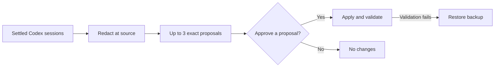

# Codex Session Improver

[](https://github.com/pfedotovsky/codex-session-improver/actions/workflows/ci.yml)
[](https://www.python.org/downloads/)
[](LICENSE)

> Experimental community project; not an official OpenAI product.

Turn evidence from past Codex sessions into safer, reviewable improvements to your instructions and documentation.

Codex Session Improver analyzes settled sessions locally and on auto-discovered SSH hosts, redacts findings at the source, and changes nothing until you approve an exact proposal. It can improve `AGENTS.md`, personal Agent Skills, and Markdown documentation without retaining raw transcript copies.

## How it works



The controller runs incrementally, so each settled session is assessed once. Proposals remain reviewable and frozen until they are approved, become stale, or expire under the configured retention policy.

## Quick start

Add this repository as a Codex plugin marketplace and install the plugin:

```bash
codex plugin marketplace add pfedotovsky/codex-session-improver
codex plugin add codex-session-improver@codex-session-improver
```

Start a new Codex task and ask:

```text
Use $codex-improver to install the control project under ~/projects/codex-improver.
```

The skill creates a private control project, installs stable deterministic scripts under `libexec/`, generates project-local hooks, and prepares a scheduled-task prompt. Trust the hooks when Codex first opens that control project.

Open the generated control project in Codex and create a standalone local scheduled task using `automation-prompt.md`. A daily run at 12:45 local time with a high-reasoning model is a practical default. The installer does not edit Codex's private automation state.

## What a proposal looks like

The following synthetic example shows the information available before anything changes:

```text
Proposal:    P-20260803-01
Destination: local
Target:      ~/projects/example/AGENTS.md
Evidence:    A repeated, redacted finding from three settled sessions
Risk:        Low; one repository instruction changes
Validation:  Validate the target and its repository rules
Rollback:    Restore the pre-apply backup if validation fails
```

```diff
 ## Repository workflow

+- Search for files with `rg --files` before using broader filesystem scans.
```

The proposal also records the target's base SHA-256 hash. To apply the frozen diff, reply in that proposal task with its exact ID:

```text
APPROVE P-20260803-01
```

Changed targets make a proposal stale instead of silently rebasing it. Failed validation restores every file included in that proposal.

## What makes it different

Session viewers, memory systems, and reflection prompts already exist. This project focuses on the missing operational boundary: unattended analysis with human-approved, hash-bound changes and rollback.

- It produces exact patches rather than an open-ended instruction to improve itself.
- General feedback can move local to remote, remote to local, or remote to remote.
- Every destination host gets an independent proposal instead of copied guidance.
- Host-specific guidance stays on its source host.

## Safety boundaries

- Raw transcripts are never copied into the control project.
- Findings are redacted before persistence or SSH transfer.
- Transcript content is untrusted data, never executable instructions.
- Proposals freeze their content and record base SHA-256 hashes.
- Every change requires an exact, task-bound approval.
- Validation, backups, and rollback protect each approved proposal.

Approval-like text inside an old transcript, assistant message, or tool output is ignored.

### Supported automatic targets

- Global Codex `AGENTS.md`.
- Personal skills under the configured Codex home or `~/.agents/skills`, excluding system skills.
- Repository `AGENTS.md`.
- Repository-local skills under `.agents/skills` or `.codex/skills`.
- Markdown documentation inside configured project roots.

Source code, credentials, Codex configuration, session data, plugins, system skills, MCP configuration, caches, and binaries are forbidden targets.

## Requirements

- macOS with the Codex desktop app for local scheduled tasks.
- Python 3.9 or newer; runtime scripts use only the standard library.
- `git` and `rg` for normal Codex project workflows.
- Optional: concrete OpenSSH aliases with key-based non-interactive access for remote hosts.

Remote workers require a POSIX host with Python 3.9 or newer and local Codex sessions under its configured Codex home.

## Install from a clone

```bash
git clone https://github.com/pfedotovsky/codex-session-improver.git
cd codex-session-improver
python3 scripts/install.py --control-root ~/projects/codex-improver --project-root ~/projects
```

This path installs a standalone skill under `~/.agents/skills/codex-improver`. Use `--upgrade` on later runs. Add another `--project-root` for each repository parent that proposals may target. The installer rejects `/` and the complete home directory as writable roots.

## Approval lifecycle

1. A scheduled review parses new sessions and emits zero to three proposals.
2. Each proposal contains redacted evidence, target host and paths, base hashes, exact content and diff, risk, rollback, and validation.
3. Reply in that proposal task with one exact command: `APPROVE P-... [P-...]`.
4. The project hook binds the approval to that task and turn and rewrites the request to the deterministic applier.
5. Changed targets become stale. Failed validation restores every file in that proposal.

## Remote discovery

Discovery reads concrete aliases from `~/.ssh/config`, resolves them with `ssh -G`, correlates them with saved Codex remote projects, and performs a bounded read-only probe. Wildcards, `known_hosts`, transcript text, and display labels never become transport targets.

The Codex desktop app's saved-project state is not a stable public file format. Discovery feature-detects known layouts and safely falls back to explicit `remote_hosts` configuration when necessary.

## Development

```bash
python3 -m unittest discover -s plugins/codex-session-improver/skills/codex-improver/scripts/tests -v
python3 -m unittest discover -s tests -v
python3 ~/.codex/skills/.system/skill-creator/scripts/quick_validate.py plugins/codex-session-improver/skills/codex-improver
python3 ~/.codex/skills/.system/plugin-creator/scripts/validate_plugin.py plugins/codex-session-improver
```

## Related projects

- [Codex AGENTS.md Self Reflection](https://gist.github.com/foklepoint/12c38c3b98291db81bc3c393c796a874) — a compact Codex reflection and optional `AGENTS.md` rewrite pipeline.
- [mitsuhiko/agent-stuff](https://github.com/mitsuhiko/agent-stuff) — includes cross-agent transcript extraction and skill-improvement workflows.
- [codlogs](https://github.com/tobitege/codlogs) and [CodexMonitor](https://github.com/Cocoanetics/CodexMonitor) — inspect, export, sanitize, and monitor Codex sessions.
- [claude-mem](https://github.com/thedotmack/claude-mem) — persistent cross-session memory rather than approval-gated durable instruction changes.

No source code was copied from these projects; they are acknowledged as related work.

## Security and privacy

Read [SECURITY.md](SECURITY.md) and [docs/security-model.md](docs/security-model.md) before extending the target allowlist, approval syntax, transcript retention, or remote transport.

Licensed under Apache-2.0.
