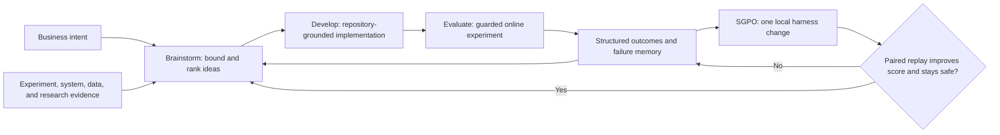
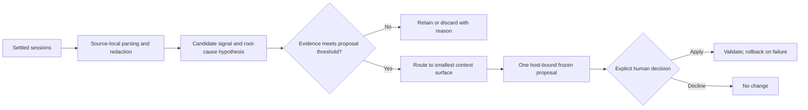

# AgentX research and relevance to Codex Improver

Status: design note

Source reviewed: [AgentX v2, arXiv:2606.26859](https://arxiv.org/abs/2606.26859)

## Main conclusion

AgentX is useful to Codex Improver mainly as a design pattern for turning operational evidence into narrow, testable changes. Its strongest transferable lesson is not “use more agents” or “put all past sessions into the prompt.” It is:

> Learn from broad evidence, but place each durable lesson in the smallest context surface that can prevent the recurring problem.

Codex Improver adopts that placement rule. It does not adopt paired replay: historical Codex sessions cannot generally be reproduced with equivalent models, tools, permissions, repository state, authentication, and external services.

## AgentX in one picture

The paper describes four connected stages:

- **Brainstorm:** normalize an underspecified objective into an explicit task boundary, gather candidate-specific evidence, and separate ideas into ready, probe-first, and backlog states.
- **Develop:** implement an admitted idea against the real repository, using schema retrieval, compiler checks, linting, and dry runs instead of relying on model recall.
- **Evaluate:** run guarded online experiments and produce structured `KEEP`, `EXTEND`, or `DISCARD` decisions. Negative and inconclusive results remain available to later work.
- **Harness evolution (SGPO):** diagnose one subagent contract, change only that local harness surface, and admit the change only if old-versus-new paired replay improves the score without violating safety constraints.

See [Sections 3–7 of the paper](https://arxiv.org/pdf/2606.26859#page=8).

## What the evidence supports

These are results reported by the AgentX authors, not independently verified measurements.

| Reported result | What it supports | What it does not establish |
| --- | --- | --- |
| Three workers moved `374 ideas → 106 validated → 100 launched → 10 launchable results` in a three-week Kuaishou deployment. | A human-gated agent loop can operate at meaningful production volume. | Long-term compounding or transfer to other domains. |
| AgentX reported 8× experiment concurrency and 3.7× cumulative app-time gain per worker-week versus one engineer baseline. | Parallel automation can trade lower precision for substantially higher throughput. | A randomized, cost-inclusive comparison or causal attribution to SGPO. |
| Per-idea rollout conversion was 2.7% for AgentX and 5.1% for the engineer. | The reported advantage came from volume, not better idea precision. | Parity with expert judgment on individual ideas. |
| A five-round SGPO example improved normalized replay score from 75.15% to 98%; one coding example improved from 2.60 to 4.90. | Local contract edits improved the paper's selected replay evaluations. | General improvement in live behavior outside those replay cases. |

See the production measurements in [Section 8.1](https://arxiv.org/pdf/2606.26859#page=29).

The main limitations are material:

- The production study covers three weeks, three workers, two internal business scenarios, and one company.
- The worker comparison is observational, not randomized.
- The reported production gains do not isolate parallelism, deterministic tooling, accumulated knowledge, and SGPO.
- SGPO evidence is case-based and includes temporary regressions, saturation, and noisy recovery.
- The report does not provide a cost-inclusive ROI comparison.
- Human review remains an admission and exception gate.
- Online A/B outcomes provide AgentX with a comparatively stable reward. General Codex sessions have no equivalent signal.

The paper is therefore credible evidence that this production loop can run. It is not proof that semantic-gradient harness evolution caused the reported gains or will compound in other environments.

## What transfers to Codex Improver

### 1. Route context before proposing it

AgentX retrieves candidate-specific evidence and changes one local harness component at a time. Codex Improver applies the same locality principle through an explicit routing contract:

| Lesson | Smallest suitable destination |
| --- | --- |
| Concise, stable behavior needed across most repositories | Global `AGENTS.md` |
| Reusable multi-step workflow with a recognizable trigger | Personal skill |
| Concise repository-specific rule, constraint, or command | Project `AGENTS.md` |
| Triggered repository-specific workflow | Project skill |
| Detailed rationale or occasional reference | Project documentation |
| Volatile authentication, service, tool, or repository state | Deterministic live inspection; no persistent fact |
| One-off incident, weak evidence, or no effective allowed target | No context change |

Every proposal records a `context_surface` and `placement_reason`. The controller rejects an unknown surface and, where the target type is knowable, a path that does not match the declared surface. This makes placement visible and auditable while retaining the existing one-host proposal, approval, hash, validation, and rollback boundaries.

### 2. Keep outcome interpretation minimal

AgentX benefits from explicit experiment outcomes. Codex Improver's evidence is less controlled: it receives bounded, redacted session slices rather than a stable experimental reward.

An audit of existing retained findings showed that the current `resolution` field already records the relevant distinction—for example, that a task recovered while its reusable cause remained open, or that a prevention reached the target environment and was validated. Explicit user corrections are already retained as redacted evidence.

The project therefore does not add parser-derived outcome or correction fields. Such fields would create false precision because successful tool outputs and complete event order are not retained, and the same inference would need to remain identical across local and remote parsers. Instead, the existing findings contract is enforced:

- `evidence`, `source_hosts`, and `resolution` must be present;
- `resolution` must state the observed session outcome separately from durable prevention;
- an explicit user correction belongs in redacted `evidence`;
- uncertain or incomplete evidence must remain explicitly inconclusive.

If later reviews show that this prose is hard to compare or aggregate, two reviewer-assigned fields can be reconsidered. That decision should be driven by observed ambiguity rather than by a desire to imitate AgentX's larger trajectory platform.

### 3. Retain negative results without building a large knowledge platform

AgentX treats failures and inconclusive experiments as assets. Codex Improver already retains redacted candidate signals with stable root-cause keys, evidence, resolution state, and proposal history. Recovered failures and below-threshold signals remain open instead of disappearing.

A larger Context Experience KB is deferred until there is evidence that the current mechanism forgets earlier findings, duplicates causes, or retrieves too much irrelevant history.

## Why paired replay is not adopted

A reliable old-versus-new Codex comparison would require both variants to use equivalent:

- model and sampling behavior;
- system and runtime context;
- tools, permissions, and authentication;
- repository and worktree state;
- external service responses;
- Desktop or CLI implementation.

Those conditions are generally unavailable for historical sessions. Synthesized tasks would also omit interaction-dependent constraints and could create false confidence while consuming substantial compute.

The resulting Codex Improver loop is:

Later sessions may support or contradict an applied change, but they should not be described as a controlled causal replay.

## Project decision

Codex Improver will:

- require and validate context placement for every new proposal;
- keep the existing outcome/correction evidence model, while enforcing its documented fields and clearer `resolution` semantics;
- preserve source-local redaction, host binding, frozen proposals, explicit approval, validation, and rollback;
- defer a larger knowledge base until a concrete continuity or retrieval failure appears;
- not implement paired replay for general Codex-session admission.

This keeps AgentX's strongest transferable principle—broad learning with narrow changes—without importing an evaluation mechanism that Codex Improver cannot reproduce faithfully.

## Sources

- [AgentX abstract and version history](https://arxiv.org/abs/2606.26859)
- [AgentX v2 full report](https://arxiv.org/pdf/2606.26859)
